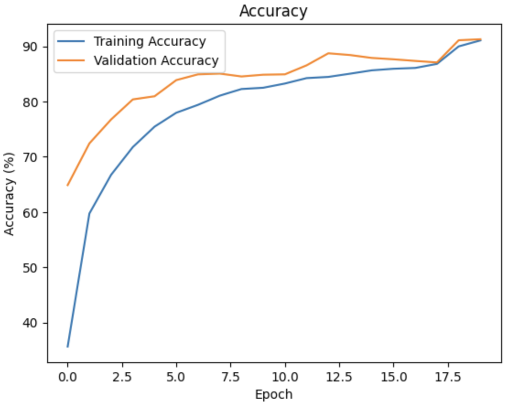

# Traffic_Sign_Classification_Cross_Stage_Partial_Network


This repository contains the code and resources for a traffic sign classification model utilizing a Cross-Stage Partial (CSP) architecture. 

## Overview
The CSP architecture enhances model efficiency by splitting feature maps at each stage, reducing computation and improving gradient flow. This project demonstrates the effectiveness of the CSP-based model in classifying traffic signs, achieving robust performance across challenging datasets.

### Key Features
- **Cross-Stage Partial (CSP) Architecture**: Efficient feature extraction and gradient flow management.
- **Spatial Pyramid Pooling (SPP)**: Multi-scale feature pooling for improved spatial resolution handling.
- **Mish Activation**: A smooth, non-monotonic activation function enhancing gradient flow.
- **Data Augmentation**: Includes random rotations, flips, and scaling of the train data in German Traffic Sign Dataset for better generalization.

## Requirements
- Python 3.7+
- PyTorch
- OpenCV
- NumPy
- Matplotlib
- Google Colab (recommended T4 for GPU access)

## Installation(Optional)

To install the required dependencies, use the `requirements.txt` file. Run the following command:

```bash
pip install -r requirements.txt
```
**Note:** The`requirements.txt` file is only necessary if you are using older versions of the packages or if any dependencies have been deprecated.

## Setup Instructions

No installation is required for this project all libraries are pre-installed on google colab environment except for pflops for evaluating efficiency. The Colab notebook provides all necessary instructions, including steps to download the dataset. You can directly run the code in Google Colab using the free T4 GPU to reproduce the results. 

## Training 
Train the model from scratch using the training code provided in the notebook. (It takes about 1 hour to train the data using T4 GPU). 
Follow the instructions in the Colab notebook to get started. 


## Dataset

The German Traffic Sign dataset is used in this project, consisting of various types of traffic signs. You can download the dataset [here](https://benchmark.ini.rub.de/gtsrb_news.html).

## Results
### Test Accuracy: 87%
Training Accuracy and Validation Accuracy Curves


Training Loss and Validation Loss Curves


## References

[1] @inproceedings{wang2021scaled,
  title={Scaled-yolov4: Scaling cross stage partial network},
  author={Wang, Chien-Yao and Bochkovskiy, Alexey and Liao, Hong-Yuan Mark},
  booktitle={Proceedings of the IEEE/cvf conference on computer vision and pattern recognition},
  pages={13029--13038},
  year={2021}
}

[2] @inproceedings{wang2020cspnet,
  title={CSPNet: A new backbone that can enhance learning capability of CNN},
  author={Wang, Chien-Yao and Liao, Hong-Yuan Mark and Wu, Yueh-Hua and Chen, Ping-Yang and Hsieh, Jun-Wei and Yeh, I-Hau},
  booktitle={Proceedings of the IEEE/CVF conference on computer vision and pattern recognition workshops},
  pages={390--391},
  year={2020}
}
